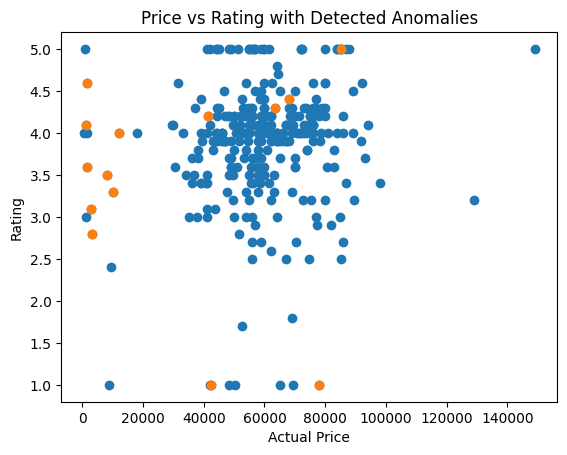

<!DOCTYPE html>
<html lang="en">
<head>
  <meta charset="UTF-8" />
  <meta name="viewport" content="width=device-width, initial-scale=1.0" />
</head>
<body>

  <h1>AC Anomaly Detection using Snowflake, AWS, and Isolation Forest</h1>

  

    This project builds an end-to-end anomaly detection pipeline for air conditioner product listings using
    <strong>AWS S3</strong>, <strong>Snowflake</strong>, <strong>Snowpark</strong>, and
    <strong>scikit-learn</strong>. The goal was to ingest raw product data from S3 into Snowflake, clean and
    engineer features inside Snowflake, then train an unsupervised machine learning model to detect unusual
    products, invalid feature values, and pricing anomalies.
  

  

  <h2>Project Overview</h2>
  

    The dataset contains product listings related to air conditioners, including product name, category, ratings,
    number of ratings, and pricing information. Because the dataset was scraped and not fully standardized,
    several fields contained inconsistent or invalid values. This project focuses on:
  

  <ul>
    <li>Building a secure AWS S3 to Snowflake ingestion pipeline</li>
    <li>Cleaning and structuring messy product data using Snowpark</li>
    <li>Engineering features from raw product titles</li>
    <li>Training an <strong>Isolation Forest</strong> anomaly detection model</li>
    <li>Validating flagged anomalies and visualizing results</li>
  </ul>

  

  <h2>Architecture</h2>
  <pre>AWS S3 Bucket
    ↓
Snowflake Storage Integration
    ↓
Snowflake External Stage
    ↓
Snowflake Table
    ↓
Snowpark Data Cleaning + Feature Engineering
    ↓
Pandas DataFrame
    ↓
Isolation Forest Anomaly Detection
    ↓
Anomaly Validation + Scatter Plot Visualization</pre>

  

  <h2>AWS Setup</h2>
  <ul>
    <li>Created an <strong>S3 bucket</strong> and uploaded the raw dataset file</li>
    <li>Created an <strong>IAM policy</strong> allowing access to the S3 bucket</li>
    <li>Created an <strong>IAM role</strong> and attached the policy so Snowflake could securely access the data</li>
  </ul>

  

  <h2>Snowflake Setup and Data Ingestion</h2>
  <ul>
    <li>Opened a Snowflake SQL workspace and connected Snowflake to the S3 bucket</li>
    <li>Created a <strong>storage integration</strong> to securely connect Snowflake to S3</li>
    <li>Defined a <strong>file format</strong> for parsing the CSV file correctly</li>
    <li>Created an <strong>external stage</strong> so Snowflake could access the S3 data before loading it into a table</li>
    <li>Created a table and loaded the data into Snowflake</li>
    <li>Dropped unnecessary columns that were not needed for modeling</li>
  </ul>

  

  <h2>Data Cleaning and Feature Engineering</h2>

  <h3>Ratings Data Cleaning</h3>

Two rating-related columns required cleaning because they contained inconsistent text and numeric formats.
Both columns were standardized into numeric features so they could be used reliably for analysis and machine learning.

<ul>
  <li>
    <strong>RATINGS:</strong> Converted rating values to numeric using a safe cast. Rows that could not be converted
    were removed, and the cleaned values were stored in a new column so the original data remained unchanged.
  </li>

  <li>
    <strong>NO_OF_RATINGS:</strong> Review counts contained text and formatting inconsistencies. A regex expression
    extracted the numeric portion, which was then converted into a numeric feature and invalid rows were removed.
  </li>
</ul>
  <h3>3. Removed Rows with Missing Prices</h3>
  

    Rows with missing prices were removed because price is a core feature for anomaly detection and pricing analysis.
    Missing price values would weaken the ML pipeline and reduce model reliability.
  

  <h3>4. Created Discount Percentage</h3>
  

    A new feature, <code>DISCOUNT_PERCENT</code>, was created to measure discount size relative to the original price.
    This is more useful than raw price difference because it normalizes discounts across products with different price ranges.
  

  <h3>Feature Extraction from Product Title</h3>

Several important product attributes were embedded inside the product title rather than stored as structured columns.
To make the dataset usable for analysis and machine learning, these attributes were extracted and stored in dedicated columns.

<ul>
  <li><strong>Brand:</strong> Extracted as the first word of the product title.</li>
  <li><strong>TON:</strong> Capacity values such as <code>1 Ton</code> or <code>1.5 Ton</code> were parsed and stored as a numeric feature.</li>
  <li><strong>AC_TYPE:</strong> Product titles were scanned for keywords like <code>Split</code> and <code>Window</code> to classify AC type.</li>
  <li><strong>STAR_RATING:</strong> Energy ratings such as <code>3 Star</code>, <code>4 Star</code>, and <code>5 Star</code> were extracted from the title and converted to numeric values.</li>
</ul>

Extracting these features transformed unstructured product titles into structured variables that could be used
for grouping, analysis, and machine learning.

  <h2>Final Feature Set</h2>
  
After cleaning and feature engineering, the final structured dataset included:

  <ul>
    <li><code>NAME</code></li>
    <li><code>BRAND</code></li>
    <li><code>TON</code></li>
    <li><code>STAR_RATING</code></li>
    <li><code>AC_TYPE</code></li>
    <li><code>RATINGS_CLEAN</code></li>
    <li><code>REVIEWS_CLEAN</code></li>
    <li><code>ACTUAL_PRICE_CLEAN</code></li>
    <li><code>DISCOUNT_PRICE_CLEAN</code></li>
    <li><code>DISCOUNT_PERCENT</code></li>
  </ul>

  

  <h2>Model Training</h2>

  <h3>1. Converted Snowpark DataFrame to Pandas</h3>
  

    Once the data was cleaned inside Snowflake, it was converted from a Snowpark DataFrame into a Pandas DataFrame.
    This was done so Python ML libraries such as <strong>scikit-learn</strong> could be used for modeling.
    Cleaning was intentionally completed first in Snowflake because Snowflake is better suited for large-scale data processing.
  

  <h3>2. Created an ML Feature DataFrame</h3>
  

    A new DataFrame was created using only the numerical features required for anomaly detection. This allowed the model
    to learn relationships such as higher tonnage corresponding to higher price.
  

  <h3>3. Dropped Remaining Null Values</h3>
  

    Rows with null values in the feature set were removed. Since the dataset was large enough, dropping missing rows was
    acceptable. In smaller datasets, mean or median imputation would be a better approach.
  

  <h3>4. Scaled Numerical Features</h3>
  

    The numerical features were scaled so values with much larger ranges, such as price, would not dominate the model behavior.
    Without scaling, features like <code>ACTUAL_PRICE_CLEAN</code> could overpower smaller-range features like
    <code>TON</code> or <code>STAR_RATING</code>.
  

  <h3>5. Trained the Isolation Forest Model</h3>
  

    The project used <strong>Isolation Forest</strong>, an unsupervised anomaly detection model. This choice was made because
    the dataset did not contain labels indicating whether a product was an anomaly or not.
  

  

    A supervised model such as Logistic Regression was not suitable here because it requires labeled training data.
    However, a possible future improvement would be to first generate anomaly labels using Isolation Forest and then
    train a supervised classifier on those pseudo-labels.
  

  <h3>6. Predicted and Flagged Anomalies</h3>
  

    After training, the model predicted anomalies and assigned anomaly flags to each product. A sanity check was then
    performed to confirm that a reasonable number of rows had been identified as anomalous.
  

  

  <h2>Model Validation</h2>
  

    The flagged anomalies were manually reviewed to validate whether the model had identified meaningful outliers.
    Several valid anomaly types were detected:
  

  <ul>
    <li>
      <strong>Wrong product type:</strong> The model identified a product that was not an air conditioner at all because
      it had been interpreted as <code>1500 ton</code> instead of the normal <code>1–2 ton</code> range.
    </li>
    <li>
      <strong>Invalid feature values:</strong> One product had a <code>STAR_RATING</code> of <code>8</code>, which is outside
      the valid AC range.
    </li>
    <li>
      <strong>Wrong pricing behavior:</strong> Another flagged item was not an AC and had an unusually low price compared to
      normal AC products.
    </li>
    <li>
      <strong>Misclassified product types:</strong> A small portable cooling product was flagged because it did not match the
      normal patterns of split or window ACs.
    </li>
  </ul>

  
Based on validation, the model successfully detected:

  <ul>
    <li>Wrong products</li>
    <li>Incorrect ratings</li>
    <li>Wrong pricing</li>
    <li>Invalid feature values</li>
    <li>Misclassified product types</li>
  </ul>

  

  <h2>Visualization</h2>
  

    Matplotlib was used to create a scatter plot highlighting anomalies as yellow points.
    The x-axis represents <code>ACTUAL_PRICE_CLEAN</code> and the y-axis represents
    <code>RATINGS_CLEAN</code>.
  

  

    These two variables were chosen because they provide a strong visual representation of how products cluster under
    normal conditions. Even if a product’s price and rating appear normal on the plot, it can still be highlighted as
    an anomaly if the model detected unusual behavior in other features such as:
  

  <ul>
    <li><code>TON</code></li>
    <li><code>STAR_RATING</code></li>
    <li><code>DISCOUNT_PERCENT</code></li>
    <li><code>REVIEWS_CLEAN</code></li>
  </ul>

  

    This is important because the model does not rely only on price and rating. It evaluates all selected features
    together when determining whether a product is anomalous.
  

  

    
  

  

  <h2>Tools and Technologies</h2>
  <ul>
    <li>AWS S3</li>
    <li>AWS IAM</li>
    <li>Snowflake</li>
    <li>Snowpark</li>
    <li>Python</li>
    <li>Pandas</li>
    <li>scikit-learn</li>
    <li>Matplotlib</li>
  </ul>

  

  <h2>Key Takeaways</h2>
  <ul>
    <li>Built a secure AWS to Snowflake ingestion pipeline</li>
    <li>Cleaned messy e-commerce product data using Snowpark</li>
    <li>Engineered structured features from raw product titles</li>
    <li>Trained an unsupervised anomaly detection model using Isolation Forest</li>
    <li>Validated that flagged anomalies represented meaningful data issues and misclassified products</li>
    <li>Visualized anomaly results to support model interpretation</li>
  </ul>

  

</body>
</html>
